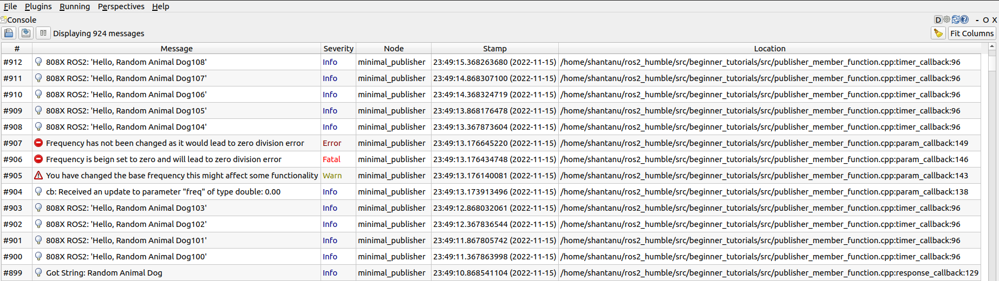
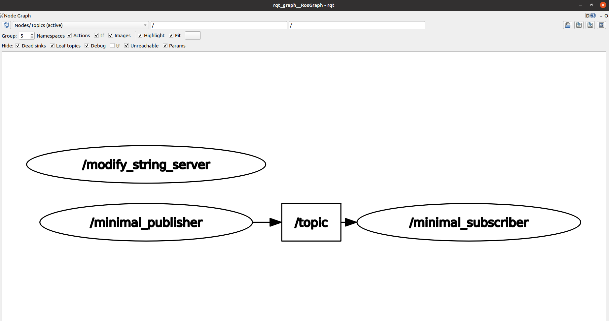

# Programming Assignment: ROS Publisher/Subscriber
***
**Subject:** ENPM 808X  
**Name:** Shantanu Parab  
**UID:** 119347539  
**Directory ID:** sparab@umd.edu
***

### System Requirements
ROS2 Humble Hawksbill
Follow the installation instructions given in the link  
[ROS 2 Humble Hawksbill Installation](http://docs.ros.org/en/humble/Installation/Alternatives/Ubuntu-Development-Setup.html)

### Instructions to Create workspace and build package
```bash
#Create a Workspace
mkdir -p ~/ros2_ws/src
cd ~/ros2_ws/src
#Clone Package
git clone git@github.com:shantanuparabumd/beginner_tutorials.git
# cd if you're still in the ``src`` directory with the ``beginner_tutorials`` clone
cd ~/ros2_ws
rosdep install -i --from-path src --rosdistro humble -y
#Source your WS
. install/local_setup.bash
#Build Package
colcon build --packages-select beginner_tutorials
```
### Launch File Run
```bash
cd ~/ros2_ws/src/beginner_tutorials/launch
ros2 launch sytem_launch.yaml frequency:=20.0
```  
Change the frequency parameter to change the frequency default is set to 2.0  

### Instruction to run nodes
Open a new terminal to run publisher node
```bash
cd ~/ros2_ws
. install/local_setup.bash
ros2 run beginner_tutorials talker
```
Open a new terminal to run subscriber node
```bash
cd ~/ros2_ws
. install/local_setup.bash
ros2 run beginner_tutorials listener
```

Open a new terminal to run server node
```bash
cd ~/ros2_ws
. install/local_setup.bash
ros2 run beginner_tutorials server
```

### Parameter Setting
```bash
ros2 param set \minimal_publisher freq 2.0
```

### RQT
**LOGGER INFO**


**RQT GRAPH**

***
## Week 11
### TF 
In One Terminal Run
```bash
ros2 run beginner_tutorials talker
```
In Second Terminal Run 
```bash
ros2 run beginner_tutorials server
```
In another terminal run 
```bash
ros2 run tf2_ros tf2_echo world dummy
```
### TF Results
[Frames PDF](results/frames_2022-11-30_14.25.31.pdf)   
### Ros Bag Launch
Note: Make sure you delete the existing my_bag folder
```bash
cd ~/ros2_ws/src/beginner_tutorials/launch
# Run the bellow command to run along with the bag file
ros2 launch beginner_tutorials system_bag_launch.py ros_bag:='True'
# Run the bellow command to run along without the bag file
ros2 launch beginner_tutorials system_bag_launch.py
```
**Check the rosbag output**
```bash
#Run in One terminal
ros2 run beginner_tutorials listener
#Run in Another terminal
ros2 bag play my_bag
```
### Testing  
**Build Testing**  
```bash
colcon test --packages-select beginner_tutorials
```
**Verbose Output**  
```bash
colcon test --event-handlers console_direct+ --packages-select beginner_tutorials
```
**Return Status**  
```bash
colcon test-result --test-result-base build/beginner_tutorials
echo $?
```